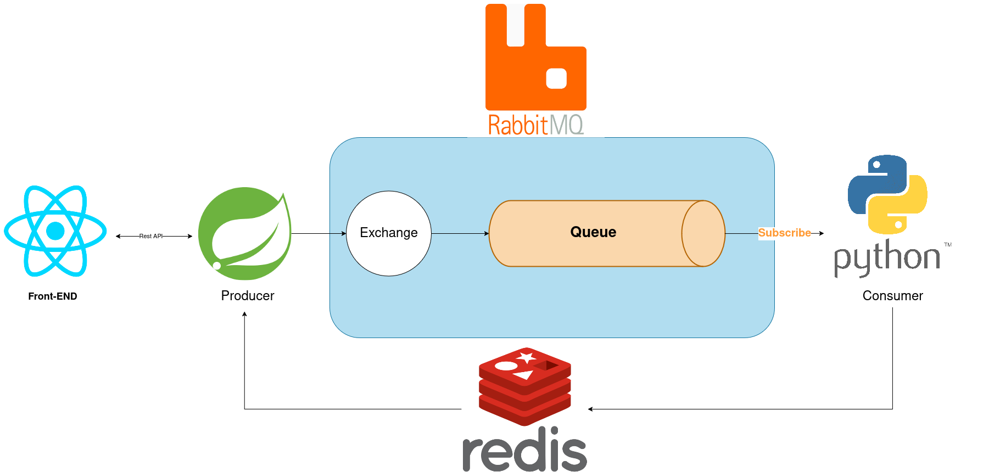
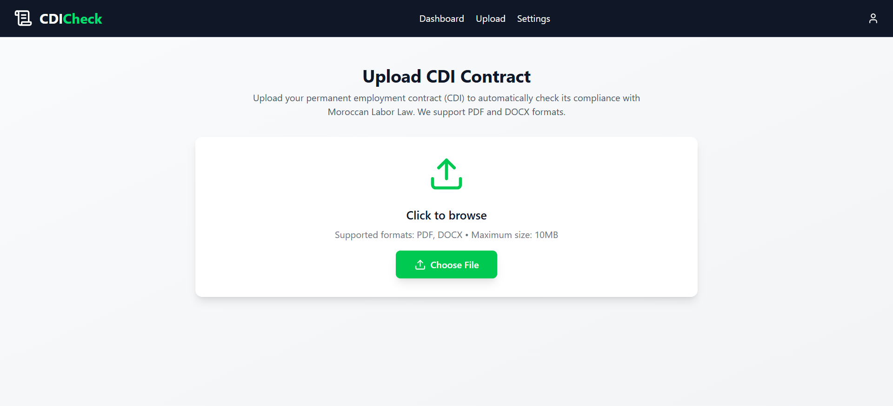
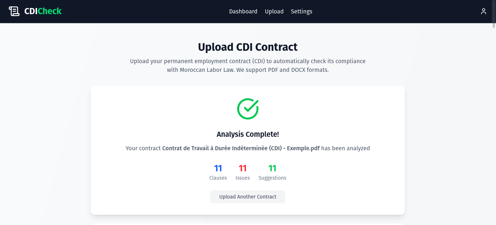

# Smart CDI Reviewer

**smart-cdi-reviewer** is an open-source LegalTech tool that automatically checks the compliance of permanent employment contracts (CDI) with Moroccan Labor Law using natural language processing and large language models.


## Overview

The project aims to help HR professionals, legal consultants, auditors, employers, and employees verify that employment contracts (CDI, CDD, or other types) comply with the Moroccan Labor Code. The system automatically extracts and analyzes clauses from submitted contracts, detects potential legal issues, and generates a structured compliance report with AI-driven insights and references to relevant labor law articles.

## System Architecture

The system consists of three main services that communicate via RabbitMQ and Redis:



### Main Services

1. **Frontend (React + Vite)**
   - Modern, responsive user interface for uploading contracts and visualizing reports
   - Built with JavaScript and Tailwind CSS

2. **Backend (Spring Boot)**
   - Handles REST APIs and message routing
   - Developed with Java 17 and role-based security

3. **AI Service (FastAPI)**
   - Processes contract text, performs clause analysis, and generates compliance reports
   - Uses **Gemini LLM**, LangChain, and Python 3.10+

### Supporting Services

- **Redis** – Caching and temporary data storage
- **RabbitMQ** – Message broker connecting the backend and AI service


## Workflow

1. User uploads a contract (PDF or DOCX) through the frontend
2. Backend extracts the text and sends it via RabbitMQ to the AI service
3. The AI service:
   - Splits and indexes the contract
   - Retrieves relevant legal clauses
   - Calls the **Gemini** model to analyze compliance
4. Results are temporarily stored in Redis and sent back to the backend
5. Frontend displays the compliance report with insights and suggestions

## Screenshots

### Contract Upload


### Contract Analysis


### Compliance Report
.png)

## Features

- Upload and analyze CDI, CDD, or other employment contracts
- AI-powered clause analysis with Google Gemini
- Automatic detection of non-compliant clauses
- Structured compliance report with issue explanations and suggestions
- Scalable microservice architecture (Docker-based)
- Asynchronous task processing via RabbitMQ
- Result caching via Redis

## Technology Stack

| Component | Technology | Purpose |
|-----------|------------|---------|
| **Frontend** | React, Vite, JavaScript, Tailwind CSS | Modern, fast, and responsive interface |
| **Backend API** | Spring Boot, Java 17 | REST APIs |
| **AI Service** | FastAPI, Python 3.10+, LangChain, Gemini API | Contract analysis and compliance assessment |
| **Message Broker** | RabbitMQ | Asynchronous communication between services |
| **Cache Store** | Redis | Intermediate results and real-time updates |
| **Containerization** | Docker, Docker Compose | Easy deployment and scaling |
| **Testing** | Pytest (Python), JUnit (Java) | Automated testing for robustness |
| **Data Storage** | JSON files | Contract data and generated reports |

## Project Structure

```
smart-cdi-reviewer/
│
├── backend/                 # Spring Boot backend (REST API, authentication)
├── frontend/                # React + Vite frontend (UI for contracts)
├── ai-service/              # Python AI microservice (LLM analysis)
├── legal-data/              # Labor law articles and compliance references
├── images/                  # Screenshots and documentation images
├── docker-compose.yml       # Multi-service Docker setup
├── README.md
├── LICENSE
└── .gitignore
```

## Getting Started

### Prerequisites

- **Docker & Docker Compose** (recommended)
- **Java 17+** (if running backend locally)
- **Python 3.10+** (if running AI service locally)
- **Node.js 20+** (if running frontend locally)

### Quick Start with Docker

1. **Clone the Repository**
   ```bash
   git clone https://github.com/devcom33/smart-cdi-reviewer.git
   cd smart-cdi-reviewer
   ```

2. **Configure Environment Variables**
   ```bash
   cp ai-service/.env.example ai-service/.env
   ```
   
   Update the `.env` file with your API keys:
   ```env
   GEMINI_API_KEY=your_api_key_here
   GEMINI_MODEL=gemini-1.5-flash
   ```

3. **Start All Services**
   ```bash
   docker compose up --build
   ```

4. **Access the Application**
   - **Frontend**: http://localhost:4173/
   - **Backend API**: http://localhost:8080/
   - **RabbitMQ Management**: http://localhost:15672/ (guest/guest)

### Local Development Setup

#### Backend Service
```bash
cd backend
./mvnw spring-boot:run
```

#### AI Service
```bash
cd ai-service
pip install -r requirements.txt
python worker.py
```

#### Frontend
```bash
cd frontend
npm install
npm run dev
```

## Usage

1. **Upload Contract**: Navigate to the frontend and upload your employment contract (PDF/DOCX)
2. **Processing**: The system automatically extracts and analyzes contract clauses
3. **Review Results**: View the comprehensive compliance report with detected issues
4. **Apply Suggestions**: Implement AI-recommended corrections for legal compliance

## Roadmap

### Phase 1 — Core Infrastructure
- [x] Setup microservices architecture
- [x] Implement asynchronous task flow
- [x] Docker containerization

### Phase 2 — AI Contract Analysis
- [x] LangChain + Gemini workflow
- [x] Contract compliance pipeline
- [x] Legal clause extraction

### Phase 3 — Frontend Enhancements
- [ ] Interactive compliance report visualization
- [ ] Multi-language UI (FR / EN)
- [ ] Advanced filtering and search

### Phase 4 — Security & Deployment
- [ ] JWT-based authentication
- [ ] CI/CD setup (GitHub Actions)
- [ ] Cloud deployment (GCP, AWS, or Azure)

## Contributors

This project is a collaboration between:

- **[Hamza](https://github.com/Hamza-Jr)** - AI/ML Development
- **[Mouad](https://github.com/devcom33)** - Full-stack Development

## Contributing

We welcome contributions! Please feel free to submit a Pull Request. For major changes, please open an issue first to discuss what you would like to change.

### Development Guidelines

1. Fork the repository
2. Create your feature branch (`git checkout -b feature/AmazingFeature`)
3. Commit your changes (`git commit -m 'Add some AmazingFeature'`)
4. Push to the branch (`git push origin feature/AmazingFeature`)
5. Open a Pull Request

## License

This project is licensed under the MIT License - see the [LICENSE](LICENSE) file for details.

## Legal Disclaimer

 **Important**: This tool provides automated legal analysis for informational purposes only and should not replace professional legal advice. Always consult with qualified legal professionals for important contractual matters.

## Support

- **Bug Reports**: [GitHub Issues](https://github.com/devcom33/smart-cdi-reviewer/issues)
- **Feature Requests**: [GitHub Discussions](https://github.com/devcom33/smart-cdi-reviewer/discussions)
- **Contact**: Open an issue for support

## Acknowledgments

- Moroccan Labor Law authorities for legal framework guidance
- Google Gemini AI team for the powerful language model
- LangChain community for the RAG framework
- Open-source contributors and beta testers

---

<div align="center">

**Made with ❤️ for the Moroccan business community**

[⭐ Star this project](https://github.com/devcom33/smart-cdi-reviewer) if you find it helpful!

</div>
